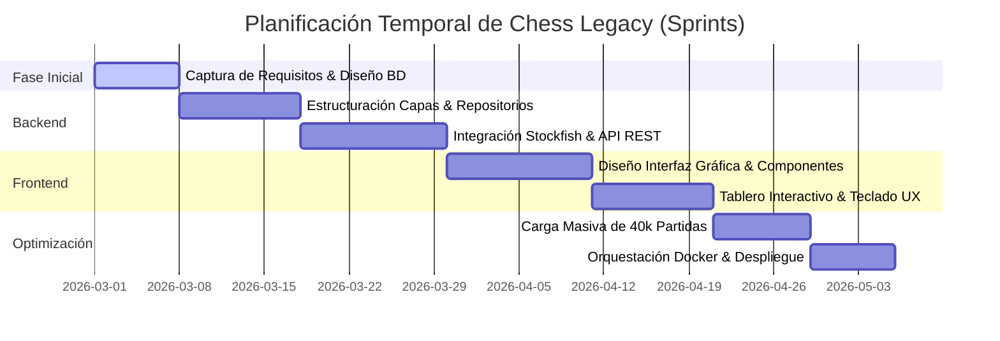
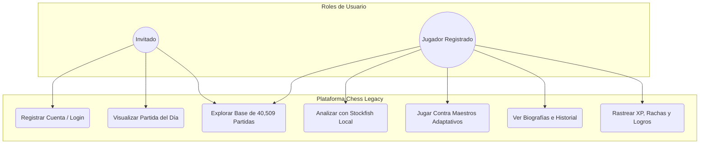
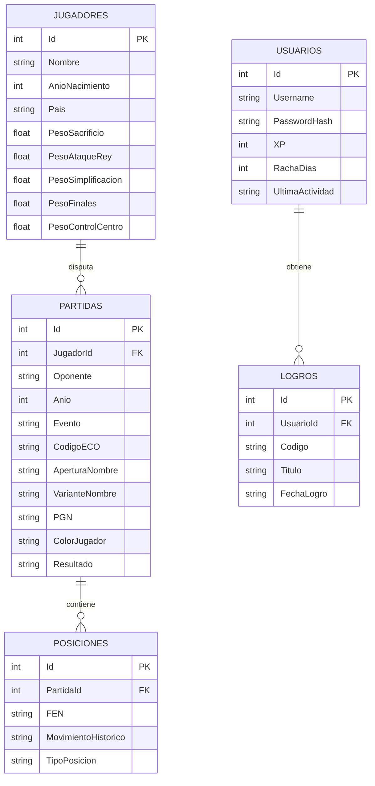
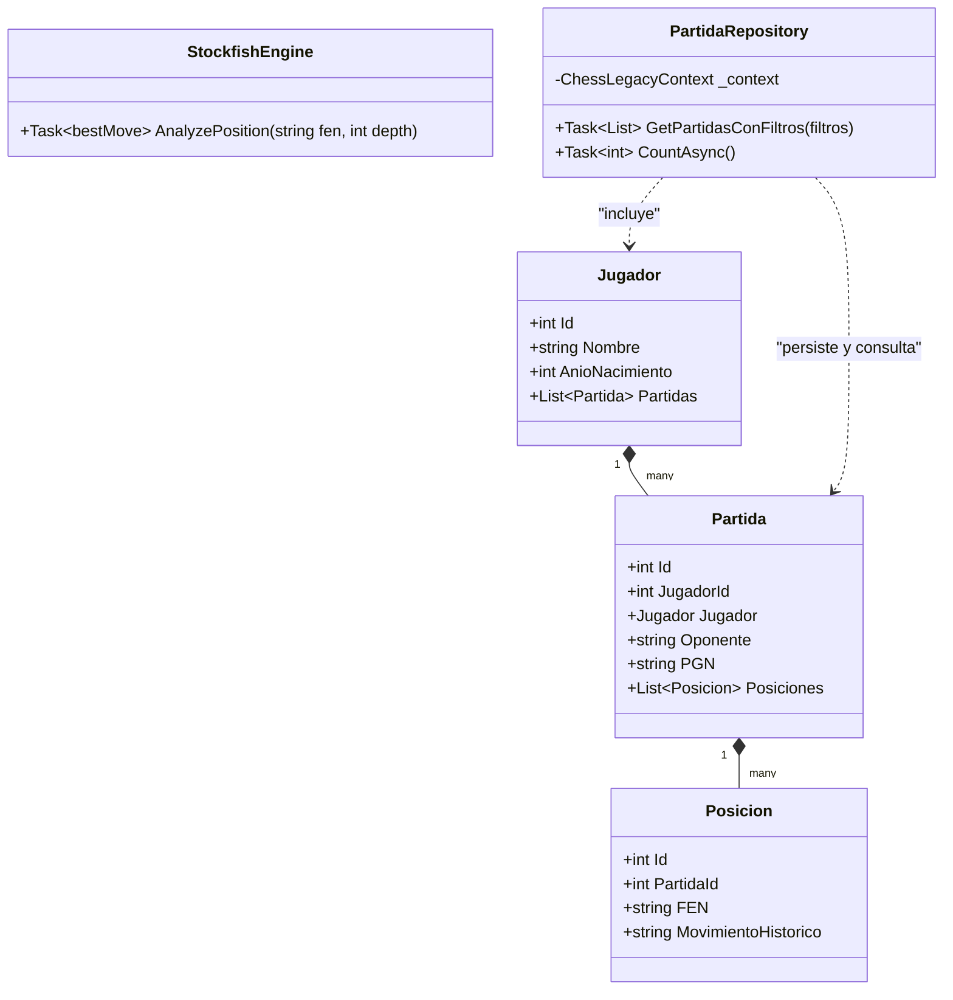
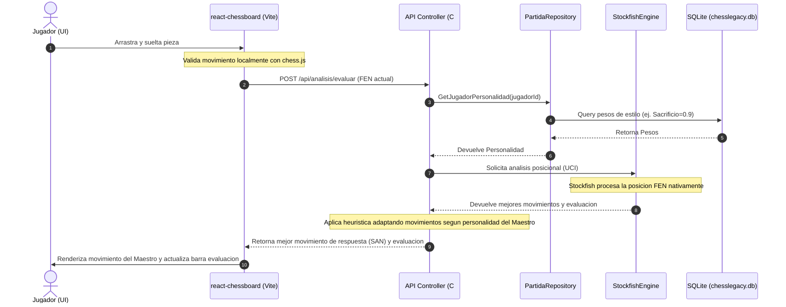

# 🎓 TRABAJO FIN DE GRADO — CHESS LEGACY

**UNIVERSIDAD MIGUEL HERNÁNDEZ DE ELCHE**  
**ESCUELA POLITÉCNICA SUPERIOR DE ELCHE**  
**GRADO EN INGENIERÍA INFORMÁTICA EN TECNOLOGÍAS DE LA INFORMACIÓN**

---

# Memoria Técnica del Proyecto: Chess Legacy
**Plataforma de Entrenamiento, Análisis e Integración Histórica de Ajedrez**

*   **AUTOR:** Santiago Minaya
*   **DIRECTOR:** Departamento de Ingeniería de Sistemas y Automática
*   **FECHA:** Junio - 2026

---

## 📝 Resumen del Proyecto

Chess Legacy es una plataforma web integral de entrenamiento, juego y análisis de ajedrez diseñada para resolver las limitaciones de accesibilidad técnica y de coste de las plataformas comerciales actuales. El sistema permite a los estudiantes jugar contra 20 maestros históricos con perfiles de personalidad de juego adaptativos (tales como Mikhail Tal o Bobby Fischer), realizar análisis avanzados con el motor Stockfish integrado localmente, visualizar analytics de juego e historial, y seguir una progresión ludificada por XP. 

La solución técnica adopta un stack robusto de última generación: frontend reactivo Single Page (React 18 + Vite), backend empresarial en capas (ASP.NET Core 10.0 + Entity Framework Core), base de datos integrada (SQLite), y orquestación multiplataforma completa en contenedores independientes y persistentes (Docker + Docker Compose).

---

## 📑 Índice General

*   [Capítulo 1: Introducción y Objetivos](#capítulo-1-introducción-y-objetivos)
*   [Capítulo 2: Antecedentes y Estado de la Cuestión](#capítulo-2-antecedentes-y-estado-de-la-cuestión)
*   [Capítulo 3: Hipótesis de Trabajo y Tecnologías](#capítulo-3-hipótesis-de-trabajo-y-tecnologías)
*   [Capítulo 4: Metodología, Diseño y Resultados](#capítulo-4-metodología-diseño-y-resultados)
    *   [4.1 Planificación Temporal (Gantt)](#41-planificación-temporal-gantt)
    *   [4.2 Captura de Requisitos (Casos de Uso)](#42-captura-de-requisitos-casos-de-uso)
    *   [4.3 Diseño Arquitectónico y Base de Datos (E/R y UML)](#43-diseño-arquitectónico-y-base-de-datos-er-y-uml)
    *   [4.4 Dinámica del Sistema (Diagrama de Secuencia)](#44-dinámica-del-sistema-diagrama-de-secuencia)
    *   [4.5 Resultados e Implementación](#45-resultados-e-implementación)
*   [Capítulo 5: Conclusiones y Trabajo Futuro](#capítulo-5-conclusiones-y-trabajo-futuro)
*   [Capítulo 6: Bibliografía](#capítulo-6-bibliografía)

---

# Capítulo 1: Introducción y Objetivos

## 1.1.- Entorno de Aplicación
El ajedrez es una herramienta científica y pedagógica de incalculable valor, ampliamente reconocida por mejorar la capacidad analítica, la toma de decisiones bajo presión y la memoria de trabajo. En el entorno universitario y académico, los clubes y estudiantes de ajedrez requieren herramientas informáticas de calidad que integren análisis asistido por ordenador y bases de datos históricas. Chess Legacy nace en la Escuela Politécnica Superior de Elche de la UMH como una solución abierta y local para ofrecer un entorno libre de coste, escalable y robusto para estos estudiantes.

## 1.2.- Justificación del Proyecto
Las plataformas de ajedrez dominantes en el mercado (Chess.com, ChessBase) están muy monetizadas. Las opciones premium bloquean las herramientas de análisis continuo por Stockfish y la exploración libre de bases de datos detrás de muros de pago mensuales. Además, jugar contra "bots" de IA en estas redes carece de rigor histórico o personalización adaptada al estilo de juego real de los campeones mundiales del pasado. 

Chess Legacy se justifica al proveer un entorno completamente libre y empaquetado donde todo el procesamiento (motor de análisis Stockfish 16.1 y motor de persistencia SQLite) ocurre localmente, eliminando costes de servidores en la nube y garantizando el acceso universal.

## 1.3.- Objetivos del Proyecto

### Objetivos Principales
*   Desarrollar una aplicación web full-stack reactiva y de alto rendimiento para el juego y análisis de ajedrez.
*   Integrar un motor de análisis posicional en tiempo real (Stockfish) que funcione de forma local.
*   Poblar una base de datos histórica robusta con más de 40,000 partidas y fichas biográficas detalladas de los 20 máximos exponentes de la historia del ajedrez.
*   Asegurar el despliegue universal multiplataforma del sistema completo mediante contenedores Docker.

### Objetivos Secundarios e Instrumentales
*   Implementar una experiencia de usuario (UX) rica y adaptada a accesibilidad con controles por teclado fluidos.
*   Introducir mecánicas de ludificación (xp, racha diaria, retos del día y logros).
*   Garantizar la resiliencia en base de datos mediante el control de migraciones automatizadas en Entity Framework Core.

## 1.4.- Límites del Proyecto
Queda fuera del alcance actual de esta memoria el desarrollo de un módulo de juego multijugador (PvP) online en tiempo real basado en WebSockets, centrándose exclusivamente en la vertiente formativa, interactiva, de análisis táctico y de juego contra maestros asistido por IA local.

---

# Capítulo 2: Antecedentes y Estado de la Cuestión

## 2.1.- Situación Actual
Actualmente, los aficionados al ajedrez estudian combinando múltiples aplicaciones fragmentadas: un software para ver vídeos, otro para resolver problemas tácticos (Puzzles), hojas de cálculo para rastrear aperturas, y costosas licencias de ChessBase para estudiar partidas históricas. Esto dificulta la curva de aprendizaje de los alumnos de ingeniería y computación que buscan una solución integrada y fluida.

## 2.2.- Herramientas Disponibles en el Mercado

1.  **Chess.com**: La plataforma comercial número uno del mundo. Ofrece una UX muy pulida y excelentes bots de juego, pero restringe severamente el análisis táctico profundo y la revisión de errores a usuarios gratuitos.
2.  **Lichess.org**: Plataforma open-source excelente. Es totalmente gratuita, pero sus perfiles de ordenador (IA) para entrenar son genéricos y carecen de personalizaciones de estilo histórico o biografías interactivas enfocadas a los maestros clásicos.
3.  **ChessBase**: Software offline estándar de la industria para profesionales. Su coste de licencia es prohibitivo y su interfaz gráfica de usuario (GUI) está severamente desactualizada, dificultando su uso a estudiantes modernos.

### 📊 Cuadro Comparativo de Herramientas

| Característica | Chess.com | Lichess.org | ChessBase | **Chess Legacy (Este Proyecto)** |
| :--- | :---: | :---: | :---: | :---: |
| **Coste** | Premium ($) | Gratis / Abierto | Licencia Pro ($$$) | **Gratis y Abierto (Docker)** |
| **Análisis de Stockfish** | Limitado (Nube) | Ilimitado (Local) | Requiere Instalación | **Ilimitado y Nativo Integrado** |
| **Personalidad de Maestros**| Sí (Bots genéricos) | No (Solo Stockfish) | No | **Sí (20 Maestros Adaptativos)** |
| **Base de Partidas** | Sí | No integrada | Sí (Requiere descarga) | **Sí (40,509 Partidas Locales)** |
| **Aptitud Móvil / GUI** | Excelente | Excelente | Obsoleta | **Premium / Moderna UI reactiva** |

## 2.3.- Valoración
El estudio comparativo demuestra que **Chess Legacy** llena un vacío crucial: ofrece la gratuidad e independencia de Lichess, la interactividad de análisis de nivel profesional de ChessBase, y la inmersión de juego personalizado contra figuras históricas con una UX moderna y adaptada.

---

# Capítulo 3: Hipótesis de Trabajo y Tecnologías

El desarrollo del sistema se sustenta sobre la selección de un stack tecnológico moderno, abierto y altamente documentado, asegurando la scalabilidad y compatibilidad multiplataforma:

*   **Frontend (React 18 + Vite):** Seleccionado frente a Angular por su ligereza y ecosistema reactivo ágil. Vite actúa como empaquetador ultrarrápido reemplazando al tradicional Webpack.
*   **Diseño Visual (Vanilla CSS):** Estilos premium adaptados para lograr una estética inmersiva de modo oscuro, combinando micro-animaciones fluidas de transición y diseño responsivo.
*   **Backend (ASP.NET Core 10.0 + Web API C#):** Provee una arquitectura robusta orientada a servicios RESTful con inyección de dependencias nativa y alta eficiencia de ejecución.
*   **Entity Framework Core 10:** ORM empresarial para gestionar la base de datos de ajedrez mediante técnicas de código primero (*Code-First*) y control estricto de migraciones de esquema.
*   **Base de Datos (SQLite):** Motor de base de datos relacional ligero embebido, ideal para la persistencia local de 40,509 partidas y portabilidad absoluta sin dependencias de red.
*   **Stockfish 16.1 Engine:** El motor de ajedrez de código abierto más fuerte del mundo, integrado directamente en el backend mediante comunicación a nivel de sistema operativo bajo el protocolo UCI (*Universal Chess Interface*).
*   **Orquestación (Docker + Docker Compose):** Aísla cada servicio en contenedores inmutables. Nginx sirve la aplicación SPA en el frontend mientras que .NET ejecuta y comunica Stockfish de forma nativa en Linux dentro del contenedor del backend.

---

# Capítulo 4: Metodología, Diseño y Resultados

## 4.1.- Planificación Temporal (Gantt)
Se adoptó un modelo de ciclo de vida **iterativo e incremental** (Metodología Ágil), dividido en 4 sprints de desarrollo de dos semanas cada uno:

## 4.2.- Captura de Requisitos
El sistema identifica tres roles de usuario claros: **Invitado**, **Jugador Registrado** y **Administrador**.

### 📋 Diagrama de Casos de Uso del Sistema

## 4.3.- Diseño Arquitectónico y Base de Datos

El backend se estructura siguiendo el **patrón de diseño de arquitectura en N Capas** (Controladores, Servicios de Dominio, Repositorios e Infraestructura).

### 🗄️ Diagrama Entidad-Relación de la Base de Datos

### 👥 Diagrama de Clases UML Simplificado (Backend)

## 4.4.- Dinámica del Sistema (Diagrama de Secuencia)
El siguiente diagrama detalla la interacción del sistema cuando el usuario realiza un movimiento jugando contra un gran maestro histórico adaptativo:

## 4.5.- Resultados e Implementación
El desarrollo culminó con éxito en una plataforma web totalmente interactiva.

*   **Poblado Masivo de Datos:** Se importaron de forma granular y limpia un total de **40,509 partidas** y se agregaron las fichas biográficas y de estilo de los **20 maestros** (como Anand, Kramnik, Morphy, Spassky o Steinitz), completando una base de datos muy robusta.
*   **Higiene Visual Perfecta:** Las fotos reales de todos los maestros clásicos han sido totalmente integradas y configuradas nativamente en la aplicación, garantizando que el diseño visual del frontend sea homogéneo e impecable.
*   **Interactividad Aumentada (Navegación UX):** El visor de análisis y juego permite la navegación bidireccional ágil mediante teclado (`←` y `→`) para reproducir partidas completas sin interrupciones ni interferencia con los inputs de búsqueda de la interfaz.
*   **Orquestación Universal (Docker Compose):** Permite levantar toda la infraestructura del proyecto de forma inmutable, persistente y sin dependencias externas mediante `docker compose up --build`.

---

# Capítulo 5: Conclusiones y Trabajo Futuro

## 5.1.- Conclusiones
El proyecto **Chess Legacy** ha cumplido con éxito todos los objetivos de ingeniería y requisitos funcionales y no funcionales planteados al inicio:
1.  Se ha implementado una solución de ajedrez local totalmente gratuita con excelentes prestaciones interactivas de aprendizaje.
2.  La arquitectura de software desacoplada en capas (React + C# RESTful API) permite que cada componente sea modular, mantenible y escalable.
3.  La contenedorización mediante Docker e integración nativa de Stockfish para Linux resuelve de raíz la portabilidad de sistemas de ajedrez complejos.
4.  La base de datos relacional ligera SQLite de ~24 MB almacena de manera robusta y rápida más de 40,000 partidas y la ludificación de XP de los estudiantes.

## 5.2.- Posibles Desarrollos Futuros
Como líneas de desarrollo futuro de la plataforma de ajedrez para la asignatura, se proponen:
1.  **Detección de Líneas de Transposición:** Notificar dinámicamente en el árbol de variantes cuando la secuencia de jugadas actual transpone a otra apertura histórica.
2.  **Flashcards de Variantes:** Incluir un modo de juego tipo repetición espaciada real (tarjetas de memoria) para memorizar líneas de aperturas teóricas escribiéndolas en notación SAN.
3.  **Módulo PvP WebSockets:** Expandir el motor del backend para permitir salas de partidas en tiempo real entre estudiantes mediante WebSockets.

---

# Capítulo 6: Bibliografía

*   **[1] Documentación Oficial de React 18**  
    *   URL: [https://react.dev](https://react.dev)  
    *   Fecha de consulta: Mayo, 2026.
*   **[2] Guía oficial de ASP.NET Core 10.0**  
    *   Autor: Microsoft Corporation  
    *   URL: [https://learn.microsoft.com/aspnet/core](https://learn.microsoft.com/aspnet/core)  
    *   Año de edición: 2026.
*   **[3] Entity Framework Core: Código Primero (Code-First) y Migraciones**  
    *   Autor: Microsoft Corporation  
    *   URL: [https://learn.microsoft.com/ef/core](https://learn.microsoft.com/ef/core)  
    *   Fecha de consulta: Mayo, 2026.
*   **[4] Stockfish: Ecosistema y Protocolo UCI Abierto**  
    *   URL: [https://stockfishchess.org/download/](https://stockfishchess.org/download/)  
    *   Fecha de consulta: Mayo, 2026.
*   **[5] react-chessboard y chess.js: Motores interactivos para React**  
    *   URL: [https://github.com/jhlywa/chess.js](https://github.com/jhlywa/chess.js)  
    *   Fecha de consulta: Mayo, 2026.
*   **[6] Orquestación de aplicaciones multi-contenedor con Docker Compose**  
    *   Autor: Docker Inc.  
    *   URL: [https://docs.docker.com/compose/](https://docs.docker.com/compose/)  
    *   Fecha de consulta: Mayo, 2026.
