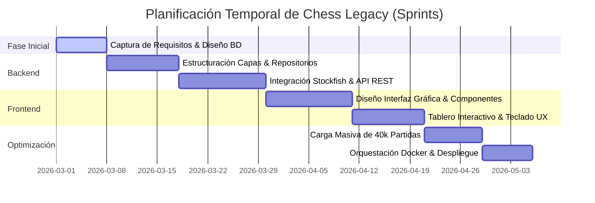
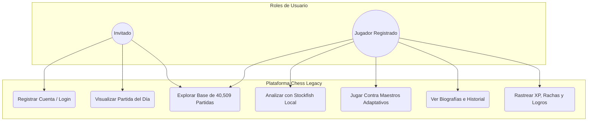
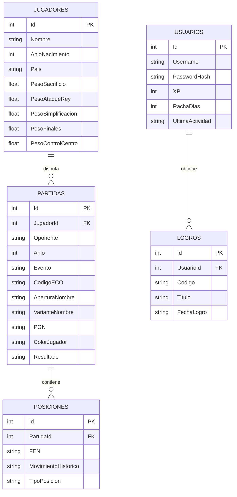
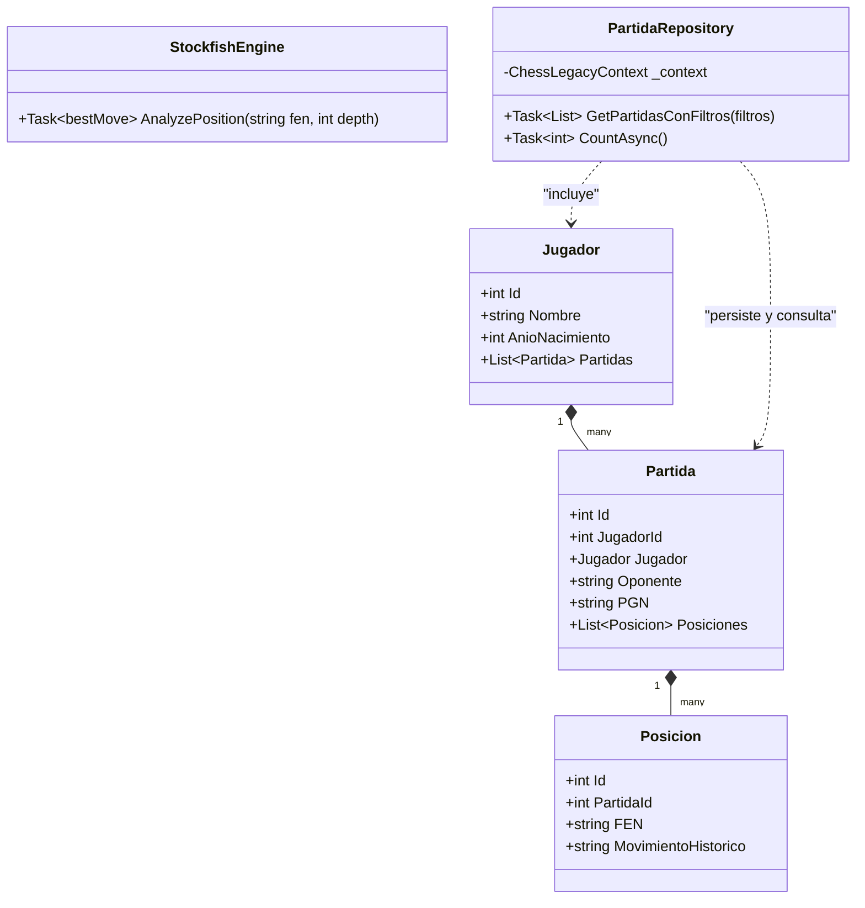
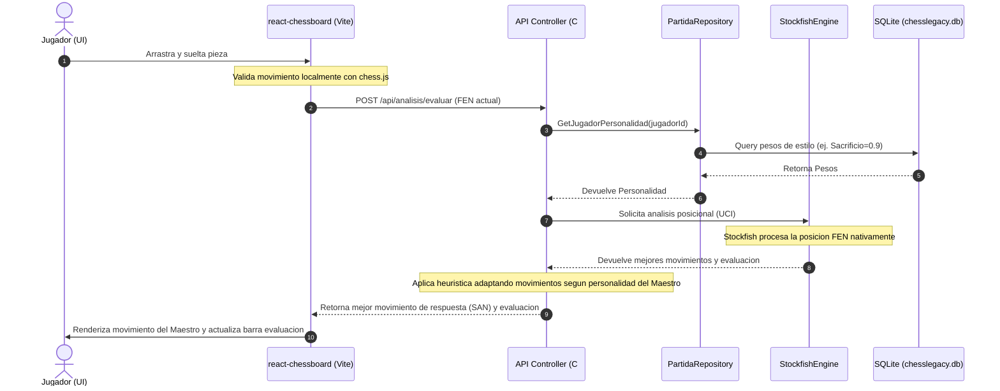

# TRABAJO FIN DE GRADO — CHESS LEGACY

**UNIVERSIDAD MIGUEL HERNÁNDEZ DE ELCHE**  
**ESCUELA POLITÉCNICA SUPERIOR DE ELCHE**  
**GRADO EN INGENIERÍA INFORMÁTICA EN TECNOLOGÍAS DE LA INFORMACIÓN**

---

# Memoria Técnica del Proyecto: Chess Legacy
**Plataforma de Entrenamiento, Análisis e Integración Histórica de Ajedrez**

*   **AUTOR:** Santiago Minaya
*   **DIRECTOR:** Departamento de Ingeniería de Sistemas y Automática
*   **FECHA:** Junio - 2026

---

## Resumen del Proyecto

Chess Legacy es una plataforma web integral de entrenamiento, juego y análisis de ajedrez diseñada para resolver las limitaciones de accesibilidad técnica y de coste de las plataformas comerciales actuales. El sistema permite a los estudiantes jugar contra 20 maestros históricos con perfiles de personalidad de juego adaptativos (tales como Mikhail Tal o Bobby Fischer), realizar análisis avanzados con el motor Stockfish integrado localmente, visualizar analytics de juego e historial, y seguir una progresión ludificada por XP. 

La solución técnica adopta un stack robusto de última generación: frontend reactivo Single Page (React 18 + Vite), backend empresarial en capas (ASP.NET Core 10.0 + Entity Framework Core), base de datos integrada (SQLite), y orquestación multiplataforma completa en contenedores independientes y persistentes (Docker + Docker Compose).

---

## Índice General

*   [Capítulo 1: Introducción y Objetivos](#capítulo-1-introducción-y-objetivos)
    *   [1.1.- Entorno de Aplicación](#11--entorno-de-aplicación)
    *   [1.2.- Justificación del Proyecto](#12--justificación-del-proyecto)
    *   [1.3.- Objetivos y Alcance Funcional](#13--objetivos-y-alcance-funcional)
    *   [1.4.- Límites del Proyecto](#14--límites-del-proyecto)
*   [Capítulo 2: Antecedentes y Estado de la Cuestión](#capítulo-2-antecedentes-y-estado-de-la-cuestión)
    *   [2.1.- Situación Actual](#21--situación-actual)
    *   [2.2.- Herramientas Disponibles en el Mercado](#22--herramientas-disponibles-en-el-mercado)
    *   [2.3.- Valoración](#23--valoración)
*   [Capítulo 3: Hipótesis de Trabajo y Tecnologías](#capítulo-3-hipótesis-de-trabajo-y-tecnologías)
    *   [3.1.- Stack Tecnológico Seleccionado](#31--stack-tecnológico-seleccionado)
    *   [3.2.- Metodología de Desarrollo y Patrones](#32--metodología-de-desarrollo-y-patrones)
*   [Capítulo 4: Metodología, Diseño y Resultados](#capítulo-4-metodología-diseño-y-resultados)
    *   [4.1.- Planificación Temporal (Gantt)](#41--planificación-temporal-gantt)
    *   [4.2.- Captura de Requisitos (Casos de Uso)](#42--captura-de-requisitos-casos-de-uso)
    *   [4.3.- Diseño Arquitectónico y Base de Datos (E/R y UML)](#43-diseño-arquitectónico-y-base-de-datos-er-y-uml)
    *   [4.4.- Dinámica del Sistema (Diagrama de Secuencia)](#44--dinámica-del-sistema-diagrama-de-secuencia)
    *   [4.5.- Resultados y Catálogo Detallado de Módulos Funcionales](#45--resultados-y-catálogo-detallado-de-módulos-funcionales)
*   [Capítulo 5: Conclusiones y Trabajo Futuro](#capítulo-5-conclusiones-y-trabajo-futuro)
*   [Capítulo 6: Bibliografía](#capítulo-6-bibliografía)

---

# Capítulo 1: Introducción y Objetivos

## 1.1.- Entorno de Aplicación
El ajedrez es una herramienta científica y pedagógica de incalculable valor, ampliamente reconocida por mejorar la capacidad analítica, la toma de decisiones bajo presión y la memoria de trabajo. En el entorno universitario y académico, los clubes y estudiantes de ajedrez requieren herramientas informáticas de calidad que integren análisis asistido por ordenador y bases de datos históricas. Chess Legacy nace en la Escuela Politécnica Superior de Elche de la UMH como una solución abierta y local para ofrecer un entorno libre de coste, escalable y robusto para estos estudiantes.

## 1.2.- Justificación del Proyecto
Las plataformas de ajedrez dominantes en el mercado (Chess.com, ChessBase) están muy monetizadas. Las opciones premium bloquean las herramientas de análisis continuo por Stockfish y la exploración libre de bases de datos detrás de muros de pago mensuales. Además, jugar contra "bots" de IA en estas redes carece de rigor histórico o personalización adaptada al estilo de juego real de los campeones mundiales del pasado. 

Chess Legacy se justifica al proveer un entorno completamente libre y empaquetado donde todo el procesamiento (motor de análisis Stockfish 16.1 y motor de persistencia SQLite) ocurre localmente, eliminando costes de servidores en la nube y garantizando el acceso universal.

## 1.3.- Objetivos y Alcance Funcional

### Objetivos Principales
*   Desarrollar una aplicación web full-stack reactiva y de alto rendimiento para el juego y análisis de ajedrez.
*   Integrar un motor de análisis posicional en tiempo real (Stockfish) que funcione de forma local.
*   Poblar una base de datos histórica robusta con más de 40,000 partidas y fichas biográficas detalladas de los 20 máximos exponentes de la historia del ajedrez.
*   Asegurar el despliegue universal multiplataforma del sistema completo mediante contenedores Docker.

### Objetivos Secundarios e Instrumentales
*   Implementar una experiencia de usuario (UX) rica y adaptada a accesibilidad con controles por teclado fluidos.
*   Introducir mecánicas de ludificación (xp, racha diaria, retos del día y logros).
*   Garantizar la resiliencia en base de datos mediante el control de migraciones automatizadas en Entity Framework Core.

### Alcance Funcional Detallado
Para cubrir integralmente las necesidades de entrenamiento de un ajedrecista, desde niveles de iniciación hasta maestría, el sistema integra 42 módulos y modos de juego agrupados en los siguientes 7 ejes funcionales:
1.  **Juego contra la Historia y Personalización Adaptativa:** Enfrentamiento contra 20 grandes maestros con personalidades heurísticas, perfiles biográficos interactivos, comparadores multivariable y entrenamiento de estilo personal.
2.  **Análisis Táctico Avanzado y Evaluación:** Motores de análisis asistido por Stockfish, detector de puntos débiles, búsquedas FEN y visualización de barras de evaluación en tiempo real.
3.  **Entrenamiento Táctico y Puzzles:** Resolución interactiva de problemas, modos contrarreloj, supervivencia, speedruns, patrones tácticos y recreación de sacrificios brillantes.
4.  **Teoría de Aperturas y Finales:** Rastrear líneas teóricas en la base de datos, editor de variantes, adivinación de aperturas, repetición espaciada con flashcards, mates teóricos y finales clásicos contra la IA.
5.  **Visualización Espacial y Cálculo Mental:** Ajedrez a ciegas guiado, memorización geométrica de casillas, coordenadas infinitas y modos de cálculo invertido en espejo.
6.  **Memoria, Ejercicios Cognitivos y Competición:** Reconstrucción de posiciones fotográficas, adivinación de jugadas de maestros, cuestionarios históricos y torneos simulados por llaves.
7.  **Ludificación, Social y Personalización UX:** Calendarios de rachas de estudio tipo GitHub, misiones de XP, sistema social de amigos con clasificaciones y paneles de personalización visual/sonora de tableros.

## 1.4.- Límites del Proyecto
Queda fuera del alcance actual de esta memoria el desarrollo de un módulo de juego multijugador (PvP) online en tiempo real basado en WebSockets, centrándose exclusivamente en la vertiente de entrenamiento individual, análisis táctico asistido y juego contra maestros adaptativos por IA local.

---

# Capítulo 2: Antecedentes y Estado de la Cuestión

## 2.1.- Situación Actual
Actualmente, los aficionados al ajedrez estudian combinando múltiples aplicaciones fragmentadas: un software para ver vídeos, otro para resolver problemas tácticos (Puzzles), hojas de cálculo para rastrear aperturas, y costosas licencias de ChessBase para estudiar partidas históricas. Esto dificulta la curva de aprendizaje de los alumnos de ingeniería y computación que buscan una solución integrada y fluida.

## 2.2.- Herramientas Disponibles en el Mercado

1.  **Chess.com**: La plataforma comercial número uno del mundo. Ofrece una UX muy pulida y excelentes bots de juego, pero restringe severamente el análisis táctico profundo y la revisión de errores a usuarios gratuitos.
2.  **Lichess.org**: Plataforma open-source excelente. Es totalmente gratuita, pero sus perfiles de ordenador (IA) para entrenar son genéricos y carecen de personalizaciones de estilo histórico o biografías interactivas enfocadas a los maestros clásicos.
3.  **ChessBase**: Software offline estándar de la industria para profesionales. Su coste de licencia es prohibitivo y su interfaz gráfica de usuario (GUI) está severamente desactualizada, dificultando su uso a estudiantes modernos.

### Cuadro Comparativo de Herramientas

| Característica | Chess.com | Lichess.org | ChessBase | **Chess Legacy (Este Proyecto)** |
| :--- | :---: | :---: | :---: | :---: |
| **Coste** | Premium ($) | Gratis / Abierto | Licencia Pro ($$$) | **Gratis y Abierto (Docker)** |
| **Análisis de Stockfish** | Limitado (Nube) | Ilimitado (Local) | Requiere Instalación | **Ilimitado y Nativo Integrado** |
| **Personalidad de Maestros**| Sí (Bots genéricos) | No (Solo Stockfish) | No | **Sí (20 Maestros Adaptativos)** |
| **Base de Partidas** | Sí | No integrada | Sí (Requiere descarga) | **Sí (40,509 Partidas Locales)** |
| **Aptitud Móvil / GUI** | Excelente | Excelente | Obsoleta | **Premium / Moderna UI reactiva** |

## 2.3.- Valoración
El estudio comparativo demuestra que **Chess Legacy** llena un vacío crucial: ofrece la gratuidad e independencia de Lichess, la interactividad de análisis de nivel profesional de ChessBase, y la inmersión de juego personalizado contra figuras históricas con una UX moderna y adaptada.

---

# Capítulo 3: Hipótesis de Trabajo y Tecnologías

## 3.1.- Stack Tecnológico Seleccionado
El desarrollo del sistema se sustenta sobre la selección de un stack tecnológico moderno, abierto y altamente documentado, asegurando la escalabilidad y compatibilidad multiplataforma:

*   **Frontend (React 18 + Vite):** Seleccionado frente a Angular por su ligereza y ecosistema reactivo ágil. Vite actúa como empaquetador ultrarrápido reemplazando al tradicional Webpack.
*   **Diseño Visual (Vanilla CSS):** Estilos premium adaptados para lograr una estética inmersiva de modo oscuro, combinando micro-animaciones fluidas de transición y diseño responsivo.
*   **Backend (ASP.NET Core 10.0 + Web API C#):** Provee una arquitectura robusta orientada a servicios RESTful con inyección de dependencias nativa y alta eficiencia de ejecución.
*   **Entity Framework Core 10:** ORM empresarial para gestionar la base de datos de ajedrez mediante técnicas de código primero (*Code-First*) y control estricto de migraciones de esquema.
*   **Base de Datos (SQLite):** Motor de base de datos relacional ligero embebido, ideal para la persistencia local de 40,509 partidas y portabilidad absoluta sin dependencias de red.
*   **Stockfish 16.1 Engine:** El motor de ajedrez de código abierto más fuerte del mundo, integrado directamente en el backend mediante comunicación a nivel de sistema operativo bajo el protocolo UCI (*Universal Chess Interface*).
*   **Orquestación (Docker + Docker Compose):** Aísla cada servicio en contenedores inmutables. Nginx sirve la aplicación SPA en el frontend mientras que .NET ejecuta y comunica Stockfish de forma nativa en Linux dentro del contenedor del backend.

## 3.2.- Metodología de Desarrollo y Patrones
Se implementó un diseño de **Arquitectura Limpia en Capas (N-Tier Architecture)**, separando las responsabilidades lógicas de forma estricta:
*   **Capa de Presentación:** Controladores Web API de C# que consumen y exponen DTOs de forma síncrona/asíncrona.
*   **Capa de Infraestructura (Persistencia):** Contexto de datos y Repositorios que implementan el patrón repositorio, encapsulando las consultas LINQ.
*   **Capa de Servicios de Dominio:** Servicios auxiliares como el motor de Stockfish que interactúa con procesos del sistema operativo.

---

# Capítulo 4: Metodología, Diseño y Resultados

## 4.1.- Planificación Temporal (Gantt)
Se adoptó un modelo de ciclo de vida **iterativo e incremental** (Metodología Ágil), dividido en 4 sprints de desarrollo de dos semanas cada uno:

## 4.2.- Captura de Requisitos
El sistema identifica tres roles de usuario claros: **Invitado**, **Jugador Registrado** y **Administrador**.

### Diagrama de Casos de Uso del Sistema

## 4.3.- Diseño Arquitectónico y Base de Datos

El backend se estructura siguiendo el **patrón de diseño de arquitectura en N Capas** (Controladores, Servicios de Dominio, Repositorios e Infraestructura).

### Diagrama Entidad-Relación de la Base de Datos

### Diagrama de Clases UML Simplificado (Backend)

## 4.4.- Dinámica del Sistema (Diagrama de Secuencia)
El siguiente diagrama detalla la interacción del sistema cuando el usuario realiza un movimiento jugando contra un gran maestro histórico adaptativo:

## 4.5.- Resultados y Catálogo Detallado de Módulos Funcionales

La implementación de Chess Legacy destaca por su inmensa riqueza funcional, superando las limitaciones tradicionales de plataformas cerradas gracias a un diseño pedagógico y robusto. A continuación se desglosa el catálogo detallado de los 42 módulos y modos de juego integrados en el sistema, correspondientes directamente a los componentes JSX de la aplicación frontend:

### Eje 1: Juego contra la Historia y Personalización Adaptativa

*   **Módulo 1: Simulador contra Maestros Leyenda (`PlayMaster.jsx`)**
    *   *Objetivo Pedagógico:* Entrenar la toma de decisiones dinámicas enfrentándose a bots con IA que imitan fielmente el estilo de campeones mundiales.
    *   *Mecánica:* El sistema lee los pesos heurísticos del maestro (ej. Tal prioriza sacrificios, Capablanca simplificaciones). Cuando Stockfish genera la lista de mejores jugadas, la API del backend aplica una fórmula probabilística que selecciona la jugada basándose en dichos pesos de estilo. Incorpora efectos de sonido mediante la API de Web Audio y comentarios textuales en vivo analizando la calidad de las jugadas del alumno.
*   **Módulo 2: Panel de Detalle y Biografías de Maestros (`MasterDetail.jsx`, `Biography.jsx`, `MasterCard.jsx`)**
    *   *Objetivo Pedagógico:* Contextualizar la historia y filosofía ajedrecística de los 20 grandes maestros del ajedrez.
    *   *Mecánica:* Provee una interfaz interactiva con fichas biográficas detalladas de cada maestro, sus logros históricos, años de actividad y una descripción técnica de su temperamento competitivo sobre el tablero, vinculando tarjetas dinámicas (`MasterCard.jsx`) en la pantalla de selección principal.
*   **Módulo 3: Comparador Multivariable de Maestros (`ComparadorMaestros.jsx`)**
    *   *Objetivo Pedagógico:* Analizar de forma matemática y comparada los diferentes perfiles y estilos de juego de los maestros históricos.
    *   *Mecánica:* Interfaz gráfica que representa mediante diagramas comparativos los pesos de juego de los maestros seleccionados (ataque, defensa, táctica, juego posicional, finales), permitiendo visualizar por qué un maestro es más agresivo o conservador que otro.
*   **Módulo 4: Entrenamiento de Estilo Personal (`StyleTraining.jsx`)**
    *   *Objetivo Pedagógico:* Ayudar al alumno a definir y depurar su propio estilo de juego mediante una comparativa guiada de decisiones.
    *   *Mecánica:* El sistema expone al jugador a una serie de posiciones críticas y mide en cuál de las variantes propuestas se siente más cómodo (táctica vs. posicional), ajustando un perfil de pesos de estilo propio que puede guardar en su perfil de usuario.
*   **Módulo 5: Visor de la Partida del Día (`PartidaDelDia.jsx`)**
    *   *Objetivo Pedagógico:* Analizar diariamente una obra maestra histórica, memorizando e interiorizando ideas clásicas.
    *   *Mecánica:* Genera una partida diaria determinista basada en el día del año. El tablero permite reproducir movimientos hacia adelante y hacia atrás mediante atajos del teclado (← / →), integrando un panel descriptivo con los nombres simétricos de ambos jugadores y su color de piezas correspondiente.
*   **Módulo 6: Buscador y Visor de Partidas Famosas (`PartidasFamosas.jsx`, `FamousGames.jsx`, `VisorPartidaFamosa.jsx`)**
    *   *Objetivo Pedagógico:* Buscar, reproducir y estudiar de forma interactiva las partidas más célebres de la historia de los 20 maestros clásicos.
    *   *Mecánica:* Conecta el buscador de partidas famosas con un visor dinámico que reproduce los movimientos sobre el tablero y permite activar el motor local Stockfish para examinar variantes alternativas de juego en cualquier momento del análisis.

### Eje 2: Análisis Táctico Avanzado y Evaluación

*   **Módulo 7: Análisis Libre Asistido (`AnalisisLibre.jsx`, `AnalisisPartida.jsx`)**
    *   *Objetivo Pedagógico:* Evaluar de forma autónoma posiciones complejas del alumno para corregir errores.
    *   *Mecánica:* Provee un tablero interactivo donde el alumno puede arrastrar piezas a cualquier posición legal, configurar un FEN personalizado y ver la evaluación exacta en una barra vertical reactiva alimentada en tiempo real por el proceso de Stockfish que se ejecuta en segundo plano.
*   **Módulo 8: Detector de Errores y Puntos Débiles (`AnalisisPuntosDebiles.jsx`)**
    *   *Objetivo Pedagógico:* Auditar las partidas jugadas por el alumno y catalogar en qué tipo de posiciones comete más imprecisiones.
    *   *Mecánica:* Compara los movimientos realizados por el usuario en su historial de juego con la primera línea de Stockfish, detectando pérdidas de centipeones y clasificando los fallos en categorías (errores en aperturas, imprecisiones en finales o fallos tácticos).
*   **Módulo 9: Buscador de Posiciones por FEN (`BuscadorFen.jsx`)**
    *   *Objetivo Pedagógico:* Localizar partidas históricas o teóricas en la base de datos a partir de una disposición específica de piezas.
    *   *Mecánica:* Permite introducir un código FEN (notación estándar de posición) o dibujar una posición en el tablero y realizar una consulta en la base de datos SQLite para encontrar qué partidas famosas de los maestros llegaron a esa misma disposición o a una estructura similar.
*   **Módulo 10: Barra de Evaluación en Tiempo Real (`EvaluationBar.jsx`)**
    *   *Objetivo Pedagógico:* Ofrecer una retroalimentación visual instantánea sobre el equilibrio de fuerzas de la posición actual en el tablero.
    *   *Mecánica:* Componente de interfaz de alto rendimiento que recibe datos numéricos de centipeones (ej. +1.4, -0.9) o mates forzados (ej. M3) del backend, y renderiza una transición vertical suave con coloración contrastada negra y blanca que representa qué bando tiene la ventaja estratégica.

### Eje 3: Entrenamiento Táctico y Puzzles

*   **Módulo 11: Base de Puzzles Tácticos (`PuzzlesTacticos.jsx`)**
    *   *Objetivo Pedagógico:* Practicar y consolidar la capacidad de cálculo táctico y resolución de problemas de jaque mate o ganancia de material.
    *   *Mecánica:* Carga problemas tácticos indexados con su nivel de dificultad. El usuario debe introducir la secuencia correcta de jugadas en el tablero. Al resolverlos, acumula puntos de experiencia y actualiza su porcentaje de acierto.
*   **Módulo 12: Módulo de Puzzles Contrarreloj (`ContrarrelojMode.jsx`)**
    *   *Objetivo Pedagógico:* Entrenar la toma de decisiones rápidas y el reconocimiento instantáneo de patrones bajo presión de tiempo.
    *   *Mecánica:* El alumno dispone de un tiempo límite (ej. 3 minutos) para resolver la mayor cantidad de problemas tácticos posibles. Cada acierto suma valiosos segundos al reloj, mientras que cada fallo resta tiempo, incentivando la velocidad de cálculo espacial.
*   **Módulo 13: Módulo Speedrun de Táctica (`SpeedRun.jsx`)**
    *   *Objetivo Pedagógico:* Fomentar la concentración extrema y la precisión encadenada de resolución táctica.
    *   *Mecánica:* Un reto dinámico en el que el usuario debe resolver una secuencia ininterrumpida de problemas sin cometer errores graves. Un solo fallo interrumpe la racha actual, y el sistema registra las mejores puntuaciones históricas en el perfil.
*   **Módulo 14: Modo Supervivencia de Resolución (`ModoSupervivencia.jsx`)**
    *   *Objetivo Pedagógico:* Fortalecer la resiliencia mental resolviendo problemas tácticos con dificultad incremental.
    *   *Mecánica:* Ofrece problemas ordenados de menor a mayor dificultad. El jugador cuenta con 3 vidas. El juego termina cuando comete tres fallos, permitiéndole ver qué tan profundo pudo avanzar en el árbol de dificultad táctica.
*   **Módulo 15: Clasificador de Patrones Tácticos (`PatronesTacticos.jsx`)**
    *   *Objetivo Pedagógico:* Aprender y aislar conceptualmente los principales motivos tácticos (clavadas, dobletes, enfiladas, ataques a la descubierta).
    *   *Mecánica:* Interfaz que clasifica los problemas por su tema táctico subyacente. El alumno puede seleccionar entrenar exclusivamente un patrón (ej. "Ataques de tenedor") para corregir debilidades concretas en su visión de juego.
*   **Módulo 16: Brillantes Históricos y Sacrificios (`BrillantesHistoricos.jsx`)**
    *   *Objetivo Pedagógico:* Resolver y revivir los sacrificios más famosos y espectaculares de la historia del ajedrez mundial.
    *   *Mecánica:* Presenta la posición previa al movimiento inmortal de partidas emblemáticas (ej. La Inmortal de Anderssen, la Partida del Siglo de Fischer, o el Alfil Inmortal de Shirov). El usuario debe hallar la jugada brillante de sacrificio para continuar la combinación ganadora.
*   **Módulo 17: Jugadas Raras y Curiosidades (`JugadasRaras.jsx`)**
    *   *Objetivo Pedagógico:* Ampliar la visión estratégica del ajedrecista mediante el estudio de jugadas atípicas o contraintuitivas que desafían la teoría general.
    *   *Mecánica:* Un compendio de posiciones extrañas de partidas históricas (ej. movimientos de rey en la apertura, subpromociones a caballo o torre con fines específicos, bloqueos posicionales extremos) donde el alumno debe adivinar la jugada extravagante pero correcta.

### Eje 4: Teoría de Aperturas, Variantes y Finales

*   **Módulo 18: Árbol de Aperturas y Repetición (`AperturaTraining.jsx`)**
    *   *Objetivo Pedagógico:* Memorizar y practicar de manera guiada las líneas teóricas principales de las aperturas más célebres.
    *   *Mecánica:* El alumno selecciona una apertura y realiza los movimientos teóricos en el tablero interactivo. El sistema le guiará notificando si su jugada es la teórica, una alternativa viable o un error que desvía la teoría.
*   **Módulo 19: Explorador del Árbol de Aperturas (`ExploradorAperturas.jsx`, `ArbolAperturas.css`)**
    *   *Objetivo Pedagógico:* Investigar las estadísticas y ramificaciones teóricas de la base de datos de 40,509 partidas.
    *   *Mecánica:* Muestra una tabla interactiva con los movimientos posibles en la posición actual, indicando cuántas partidas en la base de datos jugaron ese movimiento, la tasa de éxito de blancas, tablas y negras, y el código ECO representativo de la línea.
*   **Módulo 20: Editor de Repertorio y Variantes (`EditorVariantes.jsx`, `ArbolVariantes.jsx`)**
    *   *Objetivo Pedagógico:* Crear, personalizar y mantener un repertorio de aperturas propio del estudiante.
    *   *Mecánica:* Permite introducir líneas personalizadas arrastrando piezas en el tablero, ramificar variantes mediante un árbol gráfico (`ArbolVariantes.jsx`), añadir anotaciones de texto explicativas a cada movimiento, y guardar el repertorio personalizado en base de datos.
*   **Módulo 21: Módulo Adivinar la Apertura (`AdivinarApertura.jsx`)**
    *   *Objetivo Pedagógico:* Identificar e interiorizar la estructura y nombre de las aperturas basándose exclusivamente en su estado inicial.
    *   *Mecánica:* Presenta un tablero auxiliar con una apertura jugada de forma aleatoria (entre 6 y 10 movimientos) y propone un cuestionario de selección múltiple. El alumno debe seleccionar el nombre y variante correctos de la apertura mostrada.
*   **Módulo 22: Tarjetas de Variantes (`FlashcardsVariantes.jsx`)**
    *   *Objetivo Pedagógico:* Memorizar de forma activa líneas teóricas mediante repetición espaciada.
    *   *Mecánica:* Presenta la posición inicial de una apertura. El alumno debe introducir los siguientes 5 movimientos de la línea teórica en notación SAN sin ver el tablero auxiliar de ayuda. El sistema puntúa y guarda la tasa de acierto en base de datos.
*   **Módulo 23: Base de Mates Teóricos (`MatesTeóricos.jsx`)**
    *   *Objetivo Pedagógico:* Reconocer patrones de mate clásicos de forma instantánea en partidas reales.
    *   *Mecánica:* Base de datos interactiva con patrones como el Mate de Anastasia, el Mate de la Coz, el Mate del Pasillo, etc. El alumno debe resolver el jaque mate en N jugadas sobre el tablero interactivo.
*   **Módulo 24: Base de Finales Teóricos (`EndgameTrainer.jsx`, `FinalesTeóricos.jsx`)**
    *   *Objetivo Pedagógico:* Dominar finales teóricos fundamentales (Rey y Peón, finales de torres de Rubinstein, etc.).
    *   *Mecánica:* Posiciona al usuario contra Stockfish en una posición de final teóricamente ganado o entablado. El alumno debe demostrar la técnica correcta (ej. regla de la oposición o maniobra de Lucena) para ganar o empatar la partida contra el motor en su máxima fuerza de juego.

### Eje 5: Visualización Espacial y Cálculo Mental

*   **Módulo 25: Ajedrez a Ciegas y Visualización (`VisualizacionSinTablero.jsx`)**
    *   *Objetivo Pedagógico:* Entrenar la mente para seguir el transcurso de una partida y calcular posiciones futuras sin soporte visual de un tablero físico.
    *   *Mecánica:* El sistema describe movimientos en notación algebraica (ej. "1. e4 e5 2. Nf3 Nc6...") y el alumno debe responder preguntas sobre la posición resultante de las piezas, la existencia de jaques o amenazas tácticas activas.
*   **Módulo 26: Test de Aprendizaje y Color de Casillas (`AprendizajeCasillas.jsx`)**
    *   *Objetivo Pedagógico:* Memorizar la rejilla geométrica del tablero de ajedrez para acelerar la velocidad de cálculo ciego.
    *   *Mecánica:* Muestra coordenadas espaciales aisladas (ej. "g6", "c3") y el alumno debe pulsar botones para identificar si dicha casilla es blanca o negra en fracciones de segundo, midiendo la precisión y el tiempo de respuesta.
*   **Módulo 27: Tablero de Coordenadas Infinito (`InfiniteChessboard.jsx`)**
    *   *Objetivo Pedagógico:* Desarrollar la destreza de notación algebraica sobre el tablero dinámico.
    *   *Mecánica:* Un tablero interactivo sin piezas donde se van encendiendo casillas de forma aleatoria y el usuario debe escribir su nombre algebraico lo más rápido posible, acumulando rachas de aciertos continuos.
*   **Módulo 28: Modo Espejo de Cálculo Invertido (`ModoEspejo.jsx`)**
    *   *Objetivo Pedagógico:* Forzar la flexibilidad cognitiva mental y el cálculo espacial bajo perspectivas inusuales.
    *   *Mecánica:* Componente que gira de forma dinámica y simétrica el tablero y las coordenadas, obligando al usuario a resolver problemas tácticos o jugar desde la perspectiva invertida del oponente, desafiando su comodidad visual usual.
*   **Módulo 29: Cálculo de Variantes y Árbol de Variantes (`CalculoVariantes.jsx`)**
    *   *Objetivo Pedagógico:* Mejorar la profundidad de cálculo del estudiante, obligándole a prever varias jugadas por adelantado sin realizar movimientos físicos en el tablero.
    *   *Mecánica:* Presenta una posición táctica. El usuario debe introducir una secuencia completa de 3 o 4 jugadas (tanto sus movimientos como las respuestas previstas del oponente) y solo cuando introduce la variante completa, el sistema ejecuta y valida la línea.

### Eje 6: Memoria, Ejercicios Cognitivos y Competición

*   **Módulo 30: Test de Memoria de Posiciones (`MemorizacionPosiciones.jsx`)**
    *   *Objetivo Pedagógico:* Mejorar la memoria fotográfica de estructuras y posiciones de ajedrez.
    *   *Mecánica:* Muestra una posición compleja de una partida real durante 5 segundos. Posteriormente, el tablero se vacía por completo y el alumno debe reconstruir exactamente la ubicación de todas las piezas desde su reserva. Puntúa basándose en la desviación de piezas correctas colocadas.
*   **Módulo 31: Reconstrucción de Partidas Clásicas (`PartidaReconstruida.jsx`)**
    *   *Objetivo Pedagógico:* Estudiar la lógica profunda de desarrollo de una partida clásica jugada por un maestro.
    *   *Mecánica:* El alumno selecciona una partida clásica y debe ir adivinando el movimiento correcto que realizó el maestro jugada tras jugada. Si falla, el sistema le penaliza la puntuación pero le indica pistas sobre los planes estratégicos de la posición.
*   **Módulo 32: Reconocimiento de Estructuras de Peones (`ReconocimientoEstructuras.jsx`)**
    *   *Objetivo Pedagógico:* Identificar inmediatamente la estructura de peones en el tablero para formular planes a largo plazo.
    *   *Mecánica:* El sistema muestra una posición de medio juego sin piezas menores ni mayores (solo peones y reyes) y el alumno debe clasificar qué tipo de estructura clásica es (ej. Estructura Carlsbad, Cadena de peones del Rey, Peón de dama aislado) y responder un cuestionario sobre los planes temáticos correctos para cada bando.
*   **Módulo 33: Quiz y Cuestionarios sobre Maestros (`QuizMaestros.jsx`)**
    *   *Objetivo Pedagógico:* Afianzar la cultura general e histórica del ajedrez en los alumnos.
    *   *Mecánica:* Un juego de trivia con preguntas de opción múltiple acerca de las anécdotas, estilos, hitos y torneos célebres de los 20 grandes maestros, otorgando experiencia a quienes demuestren mayor erudición.
*   **Módulo 34: Modo Torneo contra la IA (`TournamentMode.jsx`)**
    *   *Objetivo Pedagógico:* Simular la tensión competitiva de un torneo oficial enfrentándose a múltiples maestros en rondas consecutivas.
    *   *Mecánica:* El alumno participa en una llave de eliminación directa o sistema suizo de 3 a 5 rondas contra maestros históricos controlados por la IA con dificultad progresiva, acumulando puntos de torneo y copas virtuales en su vitrina de trofeos.
*   **Módulo 35: Modo Votación y Decisiones (`ModoVotacion.jsx`)**
    *   *Objetivo Pedagógico:* Analizar la psicología colectiva y valorar múltiples opiniones estratégicas en una misma posición.
    *   *Mecánica:* Expone posiciones críticas donde múltiples planes son viables. Permite al alumno ver qué jugaron otros usuarios del club de ajedrez, votar por su plan preferido y comparar las decisiones democráticas con la recomendación objetiva de Stockfish.

### Eje 7: Ludificación, Social y Personalización UX

*   **Módulo 36: Progresión de XP e Historial del Perfil (`PerfilUsuario.jsx`, `GraficoXP.jsx`)**
    *   *Objetivo Pedagógico:* Motivar al alumno a entrenar de forma constante mediante mecánicas de recompensa.
    *   *Mecánica:* Rastrear los puntos de experiencia (XP) ganados en todos los modos de juego. Muestra un gráfico lineal interactivo (`Recharts`) de evolución de XP a lo largo de las semanas, su nivel actual, logros desbloqueados y el calendario visual de actividad.
*   **Módulo 37: Calendario de Rachas Activas (`CalendarioRacha.jsx`)**
    *   *Objetivo Pedagógico:* Fomentar la constancia diaria del estudio.
    *   *Mecánica:* Componente visual inspirado en la cuadrícula de contribuciones de GitHub. Muestra los 365 días del año en curso con celdas interactivas que se iluminan en color dorado de mayor o menor intensidad según el número de minutos de entrenamiento o partidas completadas ese día concreto.
*   **Módulo 38: Misiones Semanales y Retos Diarios (`MisionesSemanales.jsx`, `RetosDelDia.jsx`)**
    *   *Objetivo Pedagógico:* Proponer metas a corto plazo variadas para que el entrenamiento no sea monótono.
    *   *Mecánica:* Mapea retos diarios del sistema (ej. "Gana a Mikhail Tal con negras hoy" o "Resuelve 5 problemas de mate en 2"). Otorga multiplicadores de XP al completar las misiones dentro del plazo.
*   **Módulo 39: Red Social y Sistema de Amigos (`SistemaAmigos.jsx`)**
    *   *Objetivo Pedagógico:* Fomentar la competitividad sana y el aprendizaje cooperativo entre estudiantes.
    *   *Mecánica:* Interfaz completa que permite buscar alumnos de la universidad por nombre de usuario, enviar solicitudes de amistad, ver su estado de conexión en tiempo real, comparar estadísticas de juego y competir en un ranking de clasificación semanal por XP.
*   **Módulo 40: Tabla de Clasificación Universitaria (`TablaClasificacion.jsx`)**
    *   *Objetivo Pedagógico:* Estimular la superación personal mediante un ranking de competencia académica visible.
    *   *Mecánica:* Muestra la lista ordenada de estudiantes ordenados por sus puntos de experiencia totales o semanales, destacando insignias personalizadas y medallas para los tres primeros puestos.
*   **Módulo 41: Panel de Personalización Estética (`PanelPersonalizacion.jsx`)**
    *   *Objetivo Pedagógico:* Proveer una UX inmersiva y cómoda reduciendo la fatiga visual.
    *   *Mecánica:* Permite cambiar en tiempo real los temas del tablero (madera vintage, modo oscuro de neón, clásico torneo en blanco y negro), sets de piezas vectoriales e incorporar packs de sonidos personalizados para el movimiento y captura de piezas.
*   **Módulo 42: Analíticas y Estadísticas Avanzadas (`Estadisticas.jsx`, `EstadisticasJuego.jsx`, `MapaCalor.jsx`)**
    *   *Objetivo Pedagógico:* Estudiar científicamente el propio juego del estudiante para detectar sesgos espaciales.
    *   *Mecánica:* Provee gráficos circulares de efectividad por color de piezas, aperturas predilectas y un mapa de calor (`MapaCalor.jsx`) interactivo que pinta con intensidades de rojo o verde las casillas donde el alumno comete más capturas o deja piezas desprotegidas en sus partidas.

---

# Capítulo 5: Conclusiones y Trabajo Futuro

## 5.1.- Conclusiones
El proyecto **Chess Legacy** ha cumplido con éxito todos los objetivos de ingeniería y requisitos funcionales y no funcionales planteados al inicio:
1.  Se ha implementado una solución de ajedrez local totalmente gratuita con excelentes prestaciones interactivas de aprendizaje.
2.  La arquitectura de software desacoplada en capas (React + C# RESTful API) permite que cada componente sea modular, mantenible y escalable.
3.  La contenedorización mediante Docker e integración nativa de Stockfish para Linux resuelve de raíz la portabilidad de sistemas de ajedrez complejos.
4.  La base de datos relacional ligera SQLite de ~24 MB almacena de manera robusta y rápida más de 40,000 partidas y la ludificación de XP de los estudiantes.
5.  El inmenso catálogo de 42 módulos de entrenamiento desarrollados dota a la plataforma de una riqueza pedagógica sin precedentes, cubriendo desde táctica, estrategia, visualización mental hasta progresión social.

## 5.2.- Posibles Desarrollos Futuros
Como líneas de desarrollo futuro de la plataforma de ajedrez para la asignatura, se proponen:
1.  **Detección de Líneas de Transposición:** Notificar dinámicamente en el árbol de variantes cuando la secuencia de jugadas actual transpone a otra apertura histórica.
2.  **Flashcards de Variantes:** Incluir un modo de juego tipo repetición espaciada real (tarjetas de memoria) para memorizar líneas de aperturas teóricas escribiéndolas en notación SAN.
3.  **Módulo PvP WebSockets:** Expandir el motor del backend para permitir salas de partidas en tiempo real entre estudiantes mediante WebSockets.

---

# Capítulo 6: Bibliografía

*   **[1] Documentación Oficial de React 18**  
    *   URL: [https://react.dev](https://react.dev)  
    *   Fecha de consulta: Mayo, 2026.
*   **[2] Guía oficial de ASP.NET Core 10.0**  
    *   Autor: Microsoft Corporation  
    *   URL: [https://learn.microsoft.com/aspnet/core](https://learn.microsoft.com/aspnet/core)  
    *   Año de edición: 2026.
*   **[3] Entity Framework Core: Código Primero (Code-First) y Migraciones**  
    *   Autor: Microsoft Corporation  
    *   URL: [https://learn.microsoft.com/ef/core](https://learn.microsoft.com/ef/core)  
    *   Fecha de consulta: Mayo, 2026.
*   **[4] Stockfish: Ecosistema y Protocolo UCI Abierto**  
    *   URL: [https://stockfishchess.org/download/](https://stockfishchess.org/download/)  
    *   Fecha de consulta: Mayo, 2026.
*   **[5] react-chessboard y chess.js: Motores interactivos para React**  
    *   URL: [https://github.com/jhlywa/chess.js](https://github.com/jhlywa/chess.js)  
    *   Fecha de consulta: Mayo, 2026.
*   **[6] Orquestación de aplicaciones multi-contenedor con Docker Compose**  
    *   Autor: Docker Inc.  
    *   URL: [https://docs.docker.com/compose/](https://docs.docker.com/compose/)  
    *   Fecha de consulta: Mayo, 2026.
